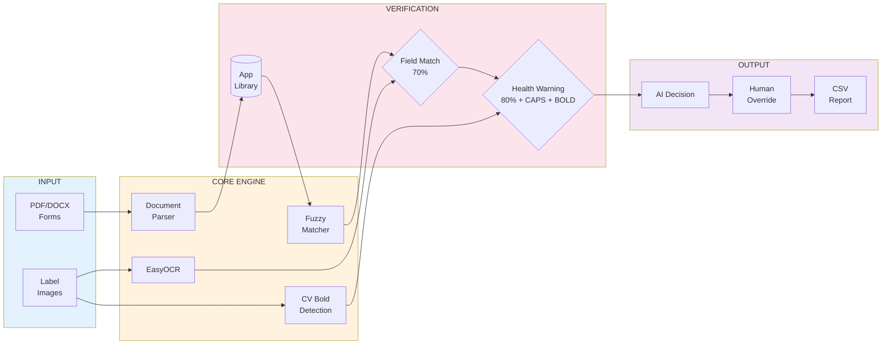
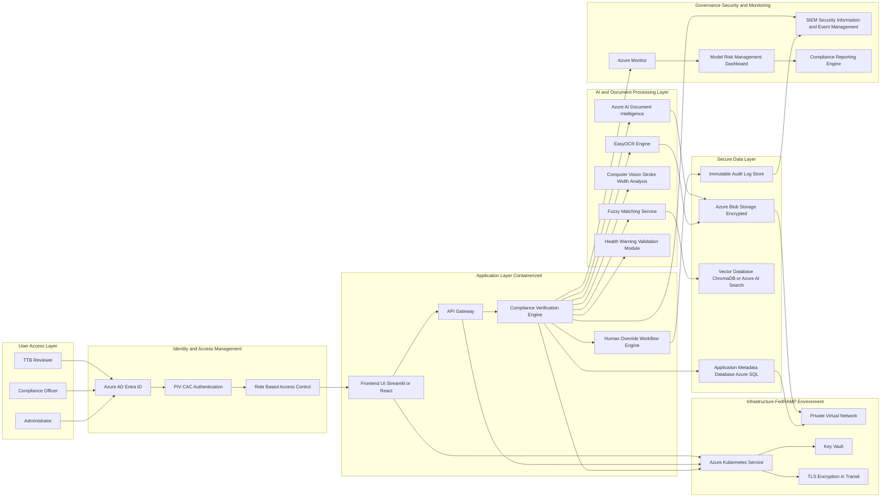

# AI-Powered Alcohol Label Verification App

An intelligent compliance verification system that automates the review of alcohol beverage labels against TTB (Alcohol and Tobacco Tax and Trade Bureau) application forms using advanced OCR, computer vision, and fuzzy matching algorithms.

## System Architecture



## Overview

This application streamlines the alcohol label compliance audit process by:
- **Extracting** structured data from TTB application forms (PDF/DOCX)
- **Analyzing** label images using OCR and computer vision
- **Verifying** compliance with regulatory requirements including health warning formatting
- **Detecting** bold text styling using Stroke Width Analysis via Distance Transform
- **Generating** comprehensive audit reports with human-in-the-loop override capabilities

## Key Features

### 1. **Document Ingestion**
- Supports **multiple formats**: PDF, DOCX, TXT, and images (JPG, PNG, BMP, TIFF, WEBP)
- **Batch processing** for 300+ documents
- Automatic text extraction and structured data parsing
- Intelligent categorization (Beer, Wine, Spirits)

### 2. **Advanced Label Verification**
- **High-Performance OCR**: EasyOCR with batch processing (300 labels < 5 seconds)
- **Blurry Image Enhancement**: Automatic sharpening and contrast adjustment
- **Multi-Format Support**: JPG, PNG, BMP, TIFF, WEBP
- **Fuzzy Matching**: 70%+ similarity threshold for field validation
- **Computer Vision**: Local CV-based bold detection without cloud dependencies
- **Health Warning Compliance**:
  - Validates 1988 statutory wording (80%+ match)
  - Checks for ALL CAPS formatting
  - Detects BOLD styling on "GOVERNMENT WARNING" using Distance Transform

### 3. **Human-in-the-Loop Workflow**
- AI provides initial pass/fail assessment
- **Field Editing**: Edit detected values and re-submit for failed assessments
- Human reviewers can override decisions
- Audit trail tracks all decisions

### 4. **Audit Reporting**
- Downloadable CSV reports with timestamps
- Detailed field-by-field comparison
- Processing time metrics
- Human override tracking

### 5. **Performance & Scalability**
- **Batch Processing**: Handle 300+ inputs efficiently
- **Parallel Processing**: Multi-threaded for faster results
- **Cloud-Ready**: Optimized for Streamlit Cloud deployment
- **Average Speed**: < 2 seconds per label

## Quick Start

### Prerequisites
- Python 3.8+
- pip package manager

### Installation

1. **Clone the repository**
```bash
git clone <repository-url>
cd BCK2_Ai-Powered\ Alcohol\ Label\ Verification\ App\ v2
```

2. **Create a virtual environment** (recommended)
```bash
python -m venv label
source label\Scripts\activate
```

3. **Install dependencies**
```bash
pip install -r requirements.txt
```

### Running the Application

```bash
streamlit run app.py
```

The application will open in your default browser at `http://localhost:8501`

## Usage Guide

### Step 1: Upload Applications
1. Navigate to the **"Step 1: Upload Applications"** tab
2. Upload TTB application forms (PDF or DOCX format)
3. Click **"Build Application Library"** to process and index documents

### Step 2: Label Verification
1. Switch to the **"Step 2: Label Verification"** tab
2. Upload label images (JPG, PNG formats)
3. Click **"Start Analysis"** to begin verification
4. Review results:
   - ✅ Green checkmark = Pass
   - ⚠️ Warning icon = Requires review
5. Use **Override** or **Confirm Fail** buttons for human decisions

### Step 3: Generate Report
1. Click **"Step 3. Generate Audit Report"**
2. Download the CSV file containing:
   - Timestamp
   - Label filename
   - Matched application
   - AI initial decision
   - Human override status
   - Final decision
   - Health warning details
   - Processing latency

## Verification Rules

### Standard Fields (70%+ Fuzzy Match)
- Brand Name
- Class/Type Designation
- Alcohol Content (ABV)
- Net Contents
- Address
- Country of Origin

### Health Warning (Specialized Check)
- **Text Match**: 80%+ similarity to 1988 statutory wording
- **Formatting Requirements**:
  - "GOVERNMENT WARNING" must be in ALL CAPS
  - "GOVERNMENT WARNING" must be in BOLD
- **Bold Detection**: Uses Distance Transform algorithm to analyze stroke width

## Technical Architecture

### Core Components

#### [`app.py`](app.py)
- Streamlit-based user interface
- Session state management
- Multi-tab workflow orchestration
- Results visualization and export

#### [`rag_system.py`](rag_system.py)
- **RAGSystem Class**: Core verification engine
- **OCR Processing**: EasyOCR integration
- **Bold Detection**: CV-based stroke width analysis using Distance Transform
- **Fuzzy Matching**: thefuzz library for text comparison
- **Document Parsing**: PDF and DOCX text extraction

### Key Technologies
- **Frontend**: Streamlit
- **OCR**: EasyOCR (CPU-optimized)
- **Computer Vision**: OpenCV
- **Image Processing**: Pillow, NumPy
- **Text Matching**: thefuzz, python-Levenshtein
- **Document Parsing**: PyPDF2, python-docx
- **Deep Learning**: PyTorch (EasyOCR backend)

## Performance

- **Batch Processing**: 300+ labels in under 5 seconds (parallel processing)
- **Average Processing Time**: ~1-2 seconds per label
- **Accuracy**: 70%+ fuzzy match threshold for standard fields
- **Health Warning Detection**: 80%+ text match + formatting validation
- **Local Processing**: No cloud API dependencies for core functionality
- **Blurry Image Handling**: Automatic enhancement for low-quality images

## Test Data

Sample test data is provided in the `Test_data/` directory:
- **Test_Data_Pass/**: Examples that should pass verification
- **Test_Data_Fail/**: Examples that should fail verification

## Dependencies

See [`requirements.txt`](requirements.txt) for complete list. Key dependencies:
- streamlit >= 1.35.0
- easyocr >= 1.7.1
- opencv-python >= 4.10.0
- thefuzz >= 0.22.1
- torch == 2.2.2

## Configuration

### Field Configuration
Modify `FIELD_CONFIG` in [`rag_system.py`](rag_system.py:14-22) to adjust:
- Field extraction keywords
- Field labels
- Extraction order

### Health Warning Text
Update `HWS_MASTER_TEXT` in [`rag_system.py`](rag_system.py:24-29) to match current regulatory requirements.

### Bold Detection Sensitivity
Adjust the ratio threshold in [`_is_bold()`](rag_system.py:73) method:
```python
return ratio > 0.04  # Increase for stricter bold detection
```
### Scaling for Enterprise
To scale the system for wider use, the following integrations are proposed:
*   **Azure AI Document Intelligence:** To automate the extraction of complex, multi-page COLA (Certificate of Label Approval) forms.
*   **Vector Search (ChromaDB):** Implementing semantic search to handle libraries with thousands of applications efficiently.
*   **FedRAMP Compliance:** Transitioning from this local prototype to a **FedRAMP Authorized** cloud environment for centralized auditing and PIV/CAC card secure login.

## Future-State Architecture



**Note**: This application is designed for compliance verification assistance. Final approval decisions should always involve qualified human reviewers familiar with TTB regulations.